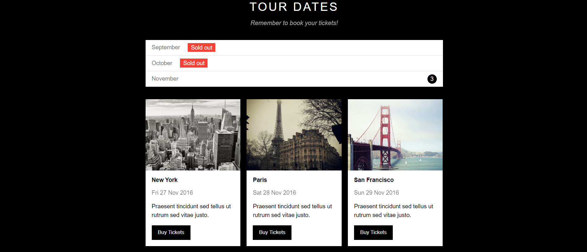

# :globe_with_meridians: Cloning Web Template - THE BAND :drum:

## :writing_hand: Description
* This web is cloned from [W3.CSS Templates](https://www.w3schools.com/w3css/w3css_templates.asp)
* [Click here](https://www.w3schools.com/w3css/tryw3css_templates_band.htm) :point_left: to see the original template
* And [Click here](https://nguyenanhphu69.github.io/Clone-w3s-template-band/) :point_left: to see the results that I have learned when did the web
* The purpose of doing this web is to practice `HTML`, `CSS`, `JavaScript` and `Web Responsive`

## :computer: Technology
`HTML` `CSS` `JavaScript`

## :camera_flash:	 Some preview images

## :books: Learn more
* I learned to do this web in [F8 - Học lập trình để đi làm](https://fullstack.edu.vn/)
* To learn more about HTML, CSS and JavaScript, you can check out [W3Schools](https://www.w3schools.com/)
